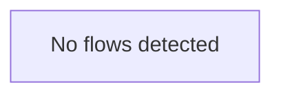

# Architecture Documentation for ai-doc-gen-i2t6qfb4

## 1. System Overview

The `ai-doc-gen-i2t6qfb4` project appears to be a web application, likely a media-sharing or social platform, featuring user authentication, video management (upload, viewing), liking, and subscription functionalities. The architecture follows a layered approach, with distinct components for routing, middleware, controllers, models, and utility functions. It integrates with an external cloud service for media storage.

**Architecture Style:** Monolithic, Layered Architecture. The backend is structured with clear separation of concerns (routes, middleware, controllers, models), while the frontend components (`.jsx` files) suggest a Single Page Application (SPA) built with a framework like React.

## 2. Architecture Diagram

## 3. Module Breakdown

This section details the responsibilities of key modules within the system.

### Core Modules

*   **config.js**: Manages application configuration, including environment variable validation (`validateEnv`). High connectivity indicates its central role in initializing the application.
*   **cloudinary.js**: Handles integration with Cloudinary for media storage and management, specifically for uploading files (`uploadOnCloudinary`).

### Backend Modules

**Controllers:**
*   **user.controller.js**: Manages user-related operations, including authentication and token generation (`genAccessAndRefreshToken`).
*   **video.controller.js**: Manages video-related operations, including safe unlinking of files (`unlinkSafe`).
*   **subscription.controller.js**: Manages user subscription logic.
*   **like.controller.js**: Manages liking/disliking functionality for content.

**Middleware:**
*   **errorHandler.middleware.js**: Centralized error handling for API requests (`errorHandler`).
*   **auth.middleware.js**: Authenticates and authorizes user requests.
*   **multer.middleware.js**: Handles multipart/form-data, primarily for file uploads, including extension validation (`isAllowedByExtension`).
*   **requestId.middleware.js**: Assigns a unique request ID to incoming requests (`requestId`).
*   **validate.middleware.js**: Provides utilities for request data validation (`validate`, `validateAll`).

**Models:**
*   **user.model.js**: Defines the schema and provides an interface for user data persistence.
*   **video.model.js**: Defines the schema and provides an interface for video data persistence.
*   **like.model.js**: Defines the schema and provides an interface for like data persistence.
*   **subscriptions.model.js**: Defines the schema and provides an interface for subscription data persistence.

**Routes:**
*   **subscription.routes.js**: Defines API endpoints for subscription-related operations.
*   **like.routes.js**: Defines API endpoints for like-related operations.
*   **video.routes.js**: Defines API endpoints for video-related operations.

**Utilities:**
*   **index.js**: Likely the application entry point, responsible for database connection (`connectDB`).
*   **asyncHandler.js**: A utility for wrapping asynchronous controller functions to catch errors (`asyncHandler`).
*   **ApiError.js**: A custom error class for standardized API error responses.
*   **ApiResponse.js**: A standardized class for API success responses.

### Frontend Modules

*   **App.jsx**: The main application component, likely handling routing and authentication-based route protection (`ProtectedRoute`, `PublicRoute`, `App`).
*   **api.js**: Utility for making API calls, including error normalization (`normalizeApiError`) and request queuing (`processQueue`).
*   **BackButton.jsx**: A reusable UI component for navigation (`BackButton`, `handleClick`).
*   **ChannelCard.jsx**: A UI component for displaying channel information, including subscription logic (`ChannelCard`, `fetchSubscriptionData`, `handleSubscribe`).
*   **EmptyState.jsx**: A UI component for displaying empty states.
*   **ErrorBoundary.jsx**: A React component for catching and displaying UI errors.
*   **Navbar.jsx**: A navigation bar component, including logout and search functionality (`Navbar`, `handleLogout`, `handleSearch`).

## 4. Data Flow

Data typically flows through the system as follows:

1.  **Client Request:** A user interacts with the frontend (e.g., `App.jsx`, `Navbar.jsx`, `ChannelCard.jsx`), triggering an API call via `api.js`.
2.  **API Call:** `api.js` sends a request to the backend server.
3.  **Backend Routing:** The request is received by the main application (`app` or `index.js`) and routed to the appropriate `*.routes.js` file (e.g., `video.routes.js`).
4.  **Middleware Processing:** The request passes through a chain of middleware (`requestId.middleware.js`, `auth.middleware.js`, `multer.middleware.js`, `validate.middleware.js`) for tasks like request ID assignment, authentication, file parsing, and input validation.
5.  **Controller Logic:** The request reaches the relevant `*.controller.js` (e.g., `video.controller.js`), which contains the business logic.
6.  **External Service Interaction:** For file uploads, the controller interacts with `cloudinary.js` to store media.
7.  **Database Interaction:** The controller interacts with the appropriate `*.model.js` (e.g., `video.model.js`) to perform CRUD operations on the database.
8.  **Response Generation:** The controller constructs a response using `ApiResponse.js` or handles errors using `ApiError.js`.
9.  **Error Handling:** If an error occurs at any stage, `errorHandler.middleware.js` catches it and sends a standardized error response.
10. **Client Response:** The backend sends the `ApiResponse` or `ApiError` back to the client. `api.js` on the frontend processes this response, potentially normalizing errors, and updates the UI.

## 5. Execution Flow

As indicated by the "No flows detected" diagram, specific execution paths are not automatically generated. However, a typical execution flow for a user action, such as "User uploads a video," would involve the following sequence:

1.  **Frontend Interaction:** User selects a video file and clicks "upload" in a UI component (e.g., within `App.jsx`).
2.  **API Request:** The frontend's `api.js` module constructs and sends a `POST` request to the `/api/v1/videos` endpoint (defined in `video.routes.js`).
3.  **Middleware Chain:**
    *   `requestId.middleware.js` assigns a unique ID.
    *   `auth.middleware.js` verifies the user's authentication token.
    *   `multer.middleware.js` processes the incoming file upload, storing it temporarily and validating its extension.
    *   `validate.middleware.js` (if applicable) validates other request body parameters.
4.  **Controller Execution:** The request reaches `video.controller.js`.
5.  **Cloudinary Upload:** `video.controller.js` calls `cloudinary.js.uploadOnCloudinary` to upload the temporary file to Cloudinary.
6.  **Database Persistence:** Upon successful upload, `video.controller.js` interacts with `video.model.js` to save the video metadata (including Cloudinary URL) to the database.
7.  **Response:** `video.controller.js` constructs an `ApiResponse` with the new video details and sends it back.
8.  **Error Handling:** If any step fails, `asyncHandler.js` catches the error, which is then processed by `errorHandler.middleware.js`, sending an `ApiError` response.
9.  **Frontend Update:** The frontend `api.js` receives the response, and the UI updates accordingly (e.g., displaying the new video or an error message).

## 6. Design Patterns

*   **Layered Architecture / MVC-like:** The clear separation into `*.routes.js` (routing), `*.middleware.js` (request processing), `*.controller.js`