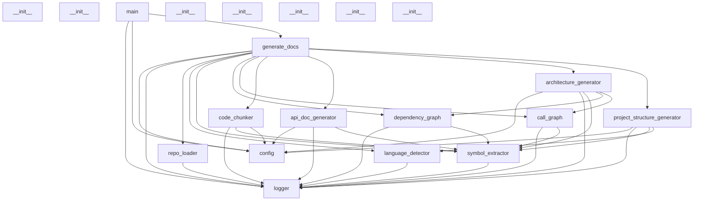
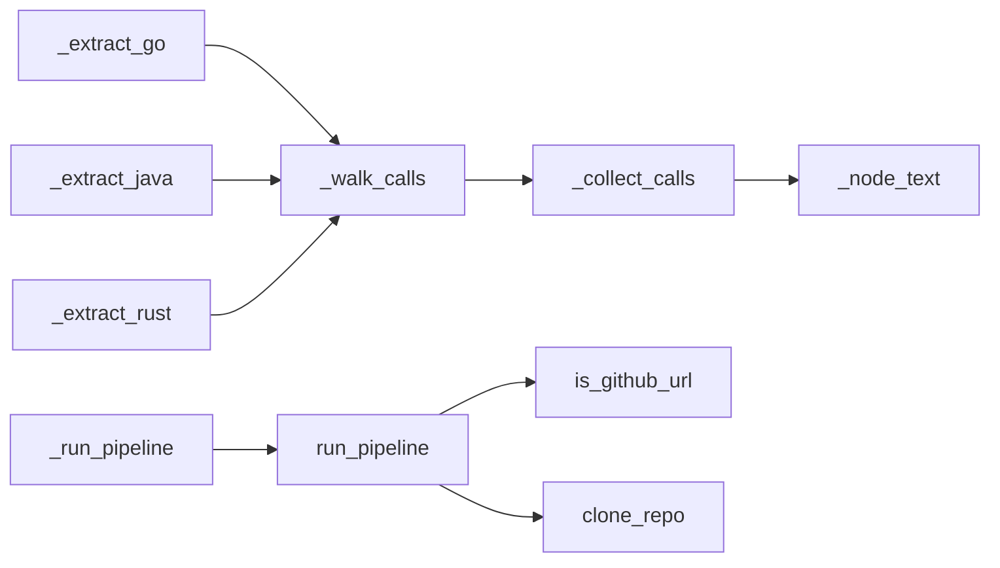

# Ai-doc-generator Architecture Documentation

## 1. System Overview

The Ai-doc-generator is a Python-based application designed to automate the generation of various documentation artifacts (API documentation, project structure, architecture, READMEs) for software projects using Large Language Models (LLMs). It processes code repositories, extracts structural and symbolic information, and leverages AI to synthesize comprehensive documentation.

The architecture follows a modular, layered approach, primarily operating as a monolithic application. It emphasizes clear separation of concerns, with dedicated modules for repository handling, code parsing, language detection, graph generation, code chunking, and AI-driven content generation.

## 2. Architecture Diagram

## 3. Module Breakdown

*   **`logger.py`**: Provides centralized logging utilities (`setup_logger`, `get_file_logger`). It is a core module, depended upon by almost all other modules for consistent logging.
*   **`config.py`**: Defines application settings and configuration (`Settings` class). It is a core module, providing configuration parameters to various parts of the system.
*   **`symbol_extractor.py`**: Extracts symbolic information (functions, classes, parameters, imports) from source code files using Tree-sitter. It is a core module, fundamental for understanding code structure.
*   **`repo_loader.py`**: Handles loading code repositories, including cloning remote Git repositories and loading local directories.
*   **`language_detector.py`**: Identifies programming languages within a project based on file extensions and content, and filters parseable files.
*   **`tree_sitter_loader.py`**: Manages Tree-sitter grammars and parsers for various languages, supporting `symbol_extractor`.
*   **`dependency_graph.py`**: Builds and summarizes module-level dependency graphs based on extracted import statements.
*   **`call_graph.py`**: Constructs call graphs to identify function/method invocation relationships and execution flows.
*   **`code_chunker.py`**: Divides source code files into manageable chunks for processing, potentially for LLM context windows.
*   **`embeddings.py`**: Provides functionality for creating and storing text embeddings, likely used for semantic search or retrieval-augmented generation (RAG).
*   **`api_doc_generator.py`**: Generates API documentation by detecting endpoints and building prompts for LLMs.
*   **`architecture_generator.py`**: Generates architecture documentation, including Mermaid diagrams, by building prompts for LLMs.
*   **`project_structure_generator.py`**: Generates project structure documentation, including annotated directory trees, by building prompts for LLMs.
*   **`readme_generator.py`**: Generates README files by building prompts for LLMs.
*   **`generate_docs.py`**: Orchestrates the entire documentation generation pipeline, acting as the main entry point for the CLI and core logic.
*   **`main.py`**: Defines the FastAPI application entry points for generating documentation and checking job status/health.
*   **`conftest.py`**: Contains fixtures for testing purposes.
*   **`test_*.py`**: Modules containing unit and integration tests for various components.

## 4. Data Flow

The system processes data in a sequential pipeline:

1.  **Input**: A repository URL (GitHub) or local file path is provided to `main.py` or `generate_docs.py`.
2.  **Repository Loading**: `repo_loader.py` clones the remote repository or loads the local project files.
3.  **File Filtering & Language Detection**: `repo_loader.py` identifies project files, which are then passed to `language_detector.py` to detect programming languages and filter for parseable files.
4.  **Symbol Extraction**: For each parseable file, `symbol_extractor.py` uses `tree_sitter_loader.py` to parse the code and extract symbols (functions, classes, imports, parameters).
5.  **Graph Generation**:
    *   `dependency_graph.py` uses extracted import symbols to build a module-level dependency graph.
    *   `call_graph.py` uses extracted function/method calls to build a call graph and identify execution flows.
6.  **Code Chunking**: `code_chunker.py` can segment source files into smaller, context-manageable chunks.
7.  **Embedding Generation (Optional/Future)**: `embeddings.py` can create and store vector embeddings of code chunks or documentation for retrieval.
8.  **Documentation Generation**:
    *   Specialized generator modules (`api_doc_generator.py`, `architecture_generator.py`, `project_structure_generator.py`, `readme_generator.py`) consume the extracted symbols, graphs, and file inventories.
    *   These modules construct detailed prompts using the gathered information and interact with an LLM (via `_get_client` functions).
    *   The LLM generates the specific documentation content.
9.  **Output**: The generated documentation (e.g., Markdown files) is returned or written to a specified output directory.
10. **Configuration & Logging**: `config.py` provides settings throughout the process, and `logger.py` records events and progress.

## 5. Execution Flow

Key execution paths:

1.  **Main Documentation Generation Flow**:
    *   `main.py: _run_pipeline` (or `generate_docs.py: generate`) initiates the process.
    *   It calls `generate_docs.py: run_pipeline`.
    *   `run_pipeline` first determines if the input is a GitHub URL using `repo_loader.py: is_github_url`.
    *   Based on the input, it either calls `repo_loader.py: clone_repo` for remote repositories or `repo_loader.py: load_local_repo` for local paths.
    *   Following repository loading, `run_pipeline` orchestrates calls to `language_detector`, `symbol_extractor`, `dependency_graph`, `call_graph`, `code_chunker`, and the various `*_generator` modules to produce documentation.

2.  **Symbol Extraction and Call Graph Building Flow**:
    *   Language-specific extraction functions (e.g., `_extract_go`, `_extract_java`, `_extract_rust`, `_extract_python` within `symbol_extractor` or `call_graph`) are invoked.
    *   These functions typically traverse the Abstract Syntax Tree (AST) or Concrete Syntax Tree (CST) using helper functions like `_walk_calls` and `_collect_calls`.
    *   Node text is retrieved via `_node_text` to identify symbols or calls.
    *   For Python imports, `_parse_python_import` specifically handles import statement parsing.

## 6. Design Patterns

*   **Strategy Pattern**: Implied in `symbol_extractor.py` and `tree_sitter_loader.py`, where different parsers and extraction logic are applied based on the detected programming language (`_get_extractor`).
*   **Facade Pattern**: `generate_docs.py: run_pipeline` acts as a facade, providing a simplified interface to the complex underlying documentation generation process.
*   **Builder Pattern**: The `_build_api_prompt`, `_build_arch_prompt`, `_build_readme_prompt`, `_build_prompt` functions in the respective generator modules exemplify the Builder pattern, constructing complex LLM prompts from various data sources.
*   **Repository Pattern**: `repo_loader.py` abstracts the details of accessing and managing code repositories (local or remote).
*   **Singleton/Global Access**: `logger.py` and `config.py` provide globally accessible instances for logging and configuration, respectively.

## 7. Scalability Considerations

*   **Bottlenecks**:
    *   **LLM API Calls**: The primary bottleneck will be the latency, rate limits, and cost associated with