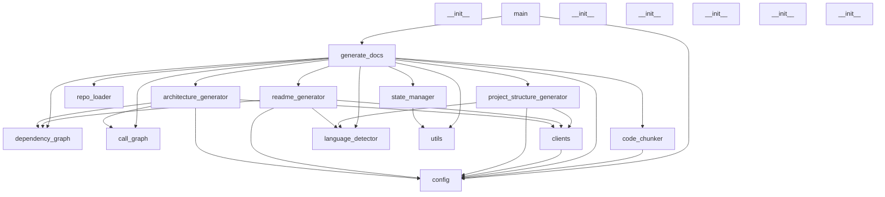
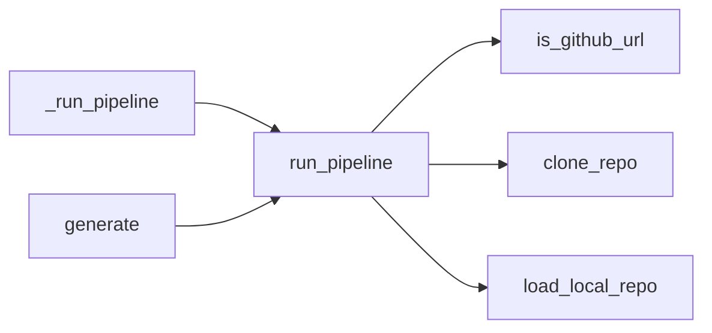

# Ai-doc-generator Architecture Documentation

## 1. System Overview

The Ai-doc-generator is an AI-powered application designed to automate the generation of comprehensive documentation for software projects. It analyzes source code repositories, extracts structural and semantic information, and leverages Large Language Models (LLMs) to produce various documentation artifacts, including project structures, READMEs, architecture overviews, and API documentation.

The system follows a layered, pipeline-oriented architecture. It processes code through distinct stages: repository loading, language detection, symbol extraction, dependency/call graph analysis, code chunking, and finally, documentation generation using LLMs.

## 2. Architecture Diagram

## 3. Module Breakdown

This section details the responsibility of each core module within the Ai-doc-generator.

*   **`main.py`**: Entry point for the application. Handles command-line interface (CLI) parsing, validation of inputs, and orchestrates the overall documentation generation pipeline via `_run_pipeline` and `generate_docs`.
*   **`generate_docs.py`**: Contains the core logic for running the documentation generation pipeline. It coordinates calls to various analysis and generation modules, manages the project state, and handles output writing.
*   **`config.py`**: Manages application settings and configuration, including API keys and other environment-dependent parameters. Ensures necessary configurations are set.
*   **`clients.py`**: Provides interfaces for interacting with external services, primarily Large Language Models (LLMs). Currently includes `get_gemini_client` for Google Gemini integration.
*   **`logger.py`**: Centralized logging utility for the application, providing functions to set up and retrieve loggers for consistent output and debugging.
*   **`repo_loader.py`**: Responsible for loading source code repositories. Supports cloning remote Git repositories (e.g., GitHub) and loading local directories.
*   **`language_detector.py`**: Identifies programming languages within the project files, filters parseable files, and groups them by language to facilitate language-specific processing.
*   **`tree_sitter_loader.py`**: Manages the loading and parsing of language grammars using Tree-sitter, a robust parsing library. Provides functions to get parsers for supported languages.
*   **`symbol_extractor.py`**: Extracts structural symbols (functions, classes, imports, parameters) from source code files using Tree-sitter parsers. Provides a language-agnostic interface for code analysis.
*   **`code_chunker.py`**: Divides source code files into manageable, semantically meaningful chunks. This is crucial for processing large files with LLMs and for generating embeddings.
*   **`dependency_graph.py`**: Builds and analyzes the module-level dependency graph of the project. Identifies relationships between files and modules based on import statements.
*   **`call_graph.py`**: Constructs and analyzes the function/method call graph, identifying execution flows and entry points within the codebase.
*   **`state_manager.py`**: Persists and retrieves the project's analyzed state (e.g., extracted symbols, graph data) to disk, allowing for caching and resuming operations.
*   **`embeddings.py`**: Manages the creation, storage, and indexing of code embeddings. Used for semantic search and retrieval-augmented generation (RAG) capabilities.
*   **`project_structure_generator.py`**: Generates documentation describing the overall project structure, including file inventory and annotated directory trees, using LLMs.
*   **`readme_generator.py`**: Focuses on generating a comprehensive `README.md` file for the project, summarizing its purpose, setup, and usage, leveraging LLMs.
*   **`architecture_generator.py`**: Creates architectural documentation, including dependency and call flow diagrams (Mermaid) and high-level system descriptions, using LLMs.
*   **`api_doc_generator.py`**: Detects API endpoints within the codebase and generates detailed API documentation for them, utilizing LLMs for descriptive text.
*   **`utils.py`**: Provides common utility functions such as atomic file writing and locked JSON saving to ensure data integrity.
*   **Test Modules (`test_*.py`, `conftest.py`)**: Contain unit and integration tests for various components, ensuring correctness and reliability of the system.

## 4. Data Flow

The data flow within the Ai-doc-generator follows a sequential pipeline:

1.  **Input**: The process begins with a user-provided repository URL or local file path.
2.  **Repository Loading**: `repo_loader` fetches the source code, either by cloning a remote Git repository or loading a local directory.
3.  **File Discovery & Language Detection**: `repo_loader` identifies all project files. `language_detector` then determines the programming language of each file and filters for parseable ones.
4.  **Symbol Extraction**: For each parseable file, `tree_sitter_loader` provides the appropriate parser, and `symbol_extractor` extracts detailed structural information (classes, functions, imports, parameters).
5.  **Code Chunking**: `code_chunker` breaks down the raw code and extracted symbols into smaller, contextually relevant chunks.
6.  **Graph Generation**:
    *   `dependency_graph` consumes extracted import symbols to build a module-level dependency graph.
    *   `call_graph` analyzes function/method definitions and calls to construct an execution flow graph.
7.  **State Persistence**: `state_manager` serializes the extracted symbols, chunks, and graph data, saving them to disk for caching and subsequent use.
8.  **Embedding Generation (Optional/Future)**: `embeddings` module processes code chunks to create vector embeddings, which can be stored and indexed for semantic search.
9.  **Documentation Generation**:
    *   Specialized generator modules (`project_structure_generator`, `readme_generator`, `architecture_generator`, `api_doc_generator`) query the processed project state (symbols, graphs, chunks).
    *   These modules construct prompts based on the extracted information and send them to the LLM via `clients.py`.
    *   The LLM generates documentation content.
10. **Output**: The generated documentation is written to the specified output directory by `generate_docs`.

## 5. Execution Flow

The primary execution flow is initiated by the `main.py` script, which orchestrates the `generate_docs` pipeline.

Key execution paths:

1.  **CLI Invocation**: A user runs the `main.py` script, which calls `generate_docs.cli()`.
2.  **Pipeline Initiation**: `generate_docs.cli()` in turn calls `generate_docs.generate()`.
3.  **Repository Handling**: `generate_docs.generate()` invokes `run_pipeline()`.
    *   `run_pipeline()` first checks if the input is a GitHub URL using `is_github_url()`.
    *   If it's a GitHub URL, `clone_repo()` is called to fetch the repository.
    *   Otherwise, `load_local_repo()` is used for local paths.
4.  **Core Analysis and Generation**: After loading, `run_pipeline()` proceeds to:
    *   Detect languages (`language_detector`).
    *   Extract symbols (`symbol_extractor`).
    *   Build dependency and call graphs (`dependency_graph`, `call_graph`).
    *   Chunk code (`code_chunker`).
    *   Persist state (`state_manager`).
    *   Call the various documentation generators (`project_structure_generator`, `readme_generator`, `architecture_generator`, `api_doc_generator`).
5.  **LLM Interaction**: Each generator module constructs prompts and interacts with the LLM via `clients.get_gemini_client()` and its `_call_llm` helper functions.
6.  **Output**: The generated content is written to the output directory.

The `_run_pipeline` function in `main.py` serves as the high-level orchestrator, delegating the detailed execution to `generate_docs.run_pipeline`.

## 6. Design Patterns

Several design patterns are evident in the Ai-doc-generator's architecture:

*   **Pipeline Pattern**: The overall structure of `generate_docs.py` and `main.py` clearly implements a pipeline, where data (codebase) flows through a series of processing stages (loading, analysis, chunking, generation).
*   **Strategy Pattern**: Implied in `symbol_extractor` and `tree_